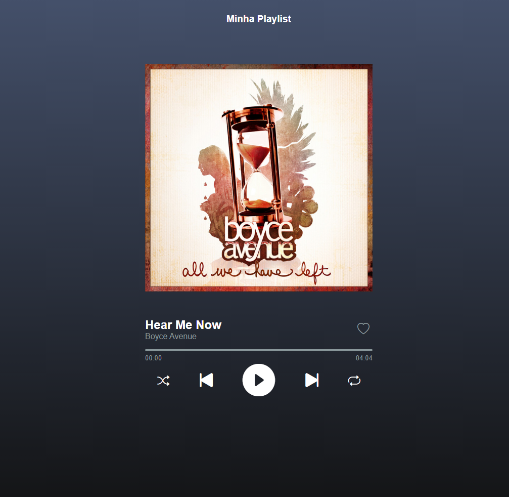
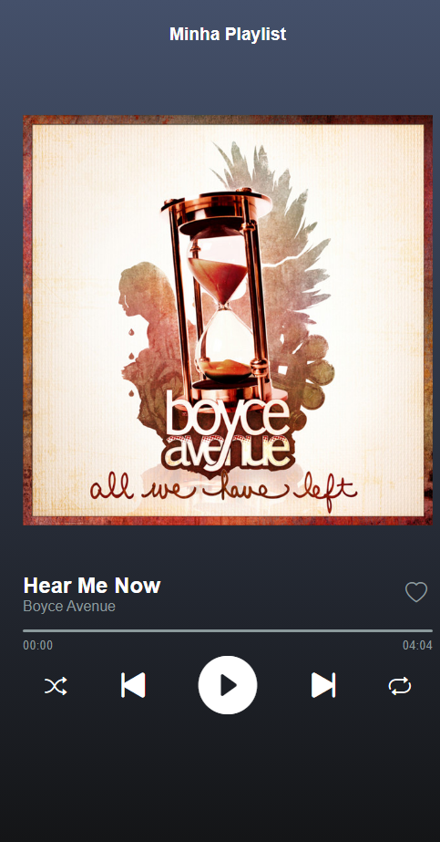

## Music Player

This project was developed by using JavaScript, HTML and CSS. It is a music player 100% functional and responsive and it was inspired by
Spotify® (mobile version). It contains 10 songs and you can like them, shuffle, repeat, skip and back them.

## Music Player (PT-BR)

Esse projeto foi desenvolvido com JavaScript, HTML e CSS. É um tocador de música 100% funcional e responsivo e foi inspirado no Spotify® 
(versão mobile). Nele contém 10 músicas e você pode curti-las, colocar em modo aleatório, repetir, avançar e voltar músicas.

 here is the link to my project --> <a href= "https://itsale-o.github.io/music-player/">My Music Player</a> :musical_note: 
 
 
## This is how desktop and mobile version look like

 

